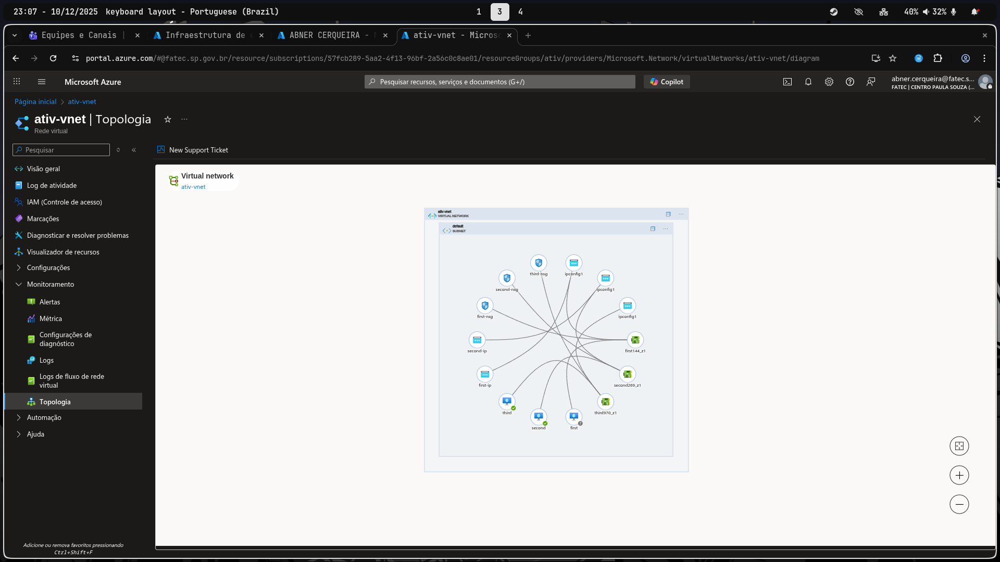
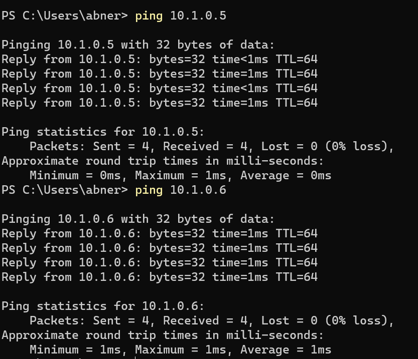

Realizei uma atividade que teve como objetivo criar uma rede e adicionar 3 maquinas nessa rede. Criei uma vm windows server e as outras 2 ubuntu, após a criação usei o arquivo RDP da máquina windows e fiz alguns testes na rede

> Topologia da rede

> Testando outras 2 maquinas da rede a partir da conexão remota com a maquina windows

